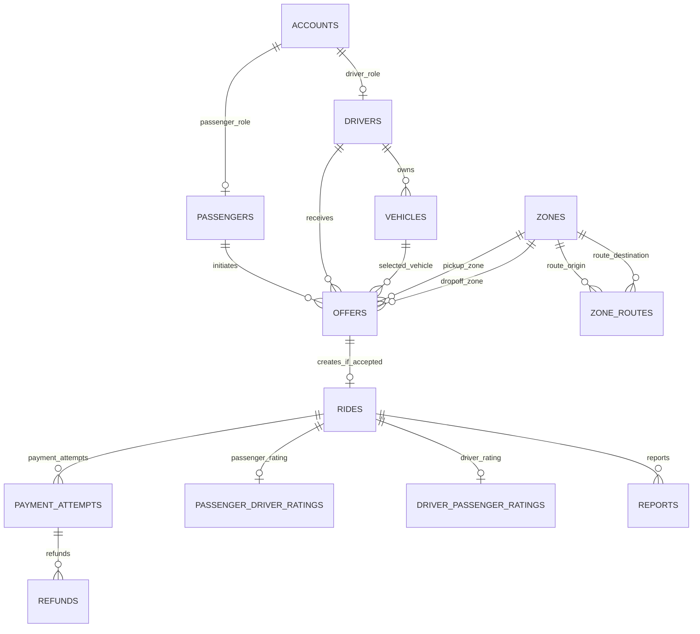

# Conceptual ERD

## Cardinality symbols

| Symbol | Meaning |
|---|---|
| `||` | Exactly one |
| `o|` | Zero or one |
| `|{` | One or many |
| `o{` | Zero or many |

## Relationships

| First table | Relationship | Second table | Meaning |
|---|---:|---|---|
| `accounts` | `1:0..1` | `passengers` | An account may have one passenger role. |
| `accounts` | `1:0..1` | `drivers` | An account may have one driver role. |
| `drivers` | `1:M` | `vehicles` | A driver may own several vehicles. |
| `passengers` | `1:M` | `offers` | A passenger may create many offers over time. |
| `drivers` | `1:M` | `offers` | A driver may receive many offers over time. |
| `vehicles` | `1:M` | `offers` | A vehicle may appear in many offers. |
| `zones` | `1:M` | `offers` | A zone may be used as pickup or destination by many offers. |
| `zones` | `1:M` | `zone_routes` | A zone may be the origin or destination of many directional routes. |
| `offers` | `1:0..1` | `rides` | An accepted offer may create one ride. |
| `rides` | `1:M` | `payment_attempts` | A ride may require several payment attempts. |
| `payment_attempts` | `1:M` | `refunds` | A captured payment may receive several refunds. |
| `rides` | `1:0..1` | each rating table | Each rating direction may produce one row. |
| `rides` | `1:M` | `reports` | A ride may have several reports. |

## Example flows

### Declined offer

The offer stores both roles, the vehicle, route, initial fare, outcome, reason, and decision time. No ride row is created.

### Completed ride

An accepted offer creates one ride. Payment attempts, optional ratings, and optional reports reference that ride.

### Cancellation before start

The accepted offer retains a ride with `CANCELLED_BEFORE_START`. Held money is released or captured money is refunded.

### Cancellation after start

The ride becomes `TERMINATED_EARLY`. Settlement and reporting remain separate records.
